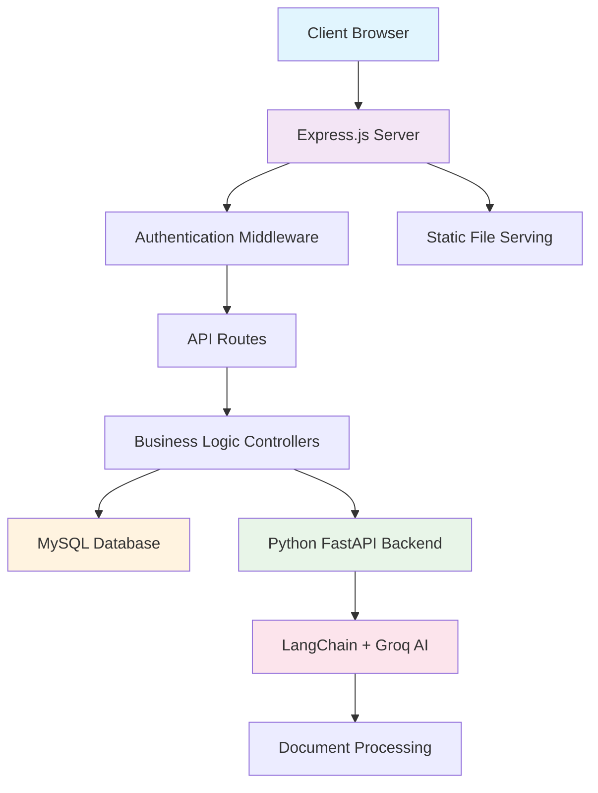

<div align="center">

#  ICP Verztec AI Chatbot

*Enterprise-grade AI-powered helpdesk solution for internal support automation*

[](https://nodejs.org/)
[](https://python.org/)
[](https://fastapi.tiangolo.com/)
[](https://expressjs.com/)
[](https://mysql.com/)
[](LICENSE)
[](https://github.com/yourusername/ICP_Verztec_Chatbot)


</div>

---

##  Table of Contents

- [Overview](#-overview)
- [Features](#-features)
- [Architecture](#️-architecture)
- [Tech Stack](#-tech-stack)
- [Installation](#-installation)
- [Usage](#-usage)
- [API Documentation](#-api-documentation)
- [Contributing](#-contributing)
- [License](#-license)

##  Overview

The ICP Verztec AI Chatbot is a sophisticated enterprise solution designed to automate internal helpdesk operations. Built with modern web technologies and AI capabilities, it provides intelligent responses to frequently asked questions, processes documents, and manages user interactions efficiently.

### Key Benefits

- **Reduced Support Workload**: Automates 80%+ of common queries
- **24/7 Availability**: Always-on support for global teams
- **Scalable Architecture**: Handles hundreds of concurrent users
- **Enterprise Security**: Role-based access control and secure authentication
- **Analytics & Insights**: Comprehensive usage tracking and reporting

##  Features

<table>
<tr>
<td width="50%">

###  **Core Capabilities**
-  **Intelligent AI Responses** - Advanced NLP processing
-  **Document Processing** - PDF, DOCX, TXT support
-  **Enterprise Authentication** - Secure user management
-  **Analytics Dashboard** - Real-time usage insights
-  **Modern Interface** - Responsive, intuitive design

</td>
<td width="50%">

###  **Advanced Features**
-  **Smart Search** - Context-aware document retrieval
-  **Admin Panel** - Complete user & system management
-  **Real-time Chat** - Instant response delivery
-  **Batch Operations** - Bulk user uploads via CSV/Excel
-  **Multi-format Support** - Various document types

</td>
</tr>
</table>

##  Architecture



##  Project Structure

```
ICP_Verztec_Chatbot/
├──  src/
│   ├──  app.js                    # Express server entry
│   ├──  package.json              # Node.js dependencies
│   │
│   ├──  backend/
│   │   ├──  controllers/          # Business logic
│   │   │   ├── 🤖 chatbotController.js
│   │   │   ├── 👤 userController.js
│   │   │   ├── 📁 fileUploadController.js
│   │   │   └── 📊 batchUploadController.js
│   │   │
│   │   ├──  database/            # Database layer
│   │   │   ├── ⚙️ dbConfig.js
│   │   │   └── 🌱 seedScript.js
│   │   │
│   │   ├──  middleware/          # Express middleware
│   │   │   └── 🔐 authenticateToken.js
│   │   │
│   │   ├──  models/              # Data models
│   │   │   ├── 📁 fileUpload.js
│   │   │   └── 👤 user.js
│   │   │
│   │   ├──  python/              # AI Backend
│   │   │   ├── 🐍 main.py          # FastAPI server
│   │   │   ├── 🧠 chatbot.py       # AI logic
│   │   │   ├── 📄 Documents_Totext.py
│   │   │   └── 📋 requirements.txt
│   │   │
│   │   └──  routes/              # API endpoints
│   │
│   └──  public/                  # Frontend assets
│       ├──  index.html           # Landing page
│       ├──  login.html           # Authentication
│       ├──  chatbot.html         # Main chat interface
│       ├──  fileUpload.html      # File management
│       ├──  admin.html           # Admin dashboard
│       ├──  analytics.html       # Analytics panel
│       ├──  styles/              # CSS stylesheets
│       └──  scripts/             # Client-side JS
```

## 🛠️ Tech Stack

<div align="center">

### Backend Technologies


### Frontend Technologies


### AI & ML


</div>

##  Installation

### Prerequisites

Ensure you have the following installed:
- **Node.js** (v18.0 or higher)
- **Python** (v3.9 or higher)
- **MySQL** (v8.0 or higher)
- **npm** or **yarn** package manager

### 🔧 Setup Instructions

1. **Clone the Repository**
   ```bash
   git clone https://github.com/yourusername/ICP_Verztec_Chatbot.git
   cd ICP_Verztec_Chatbot
   ```

2. **Database Configuration**
   ```sql
   CREATE DATABASE chatbot_db;
   CREATE USER 'chatbot_user'@'localhost' IDENTIFIED BY 'strong_password';
   GRANT ALL PRIVILEGES ON chatbot_db.* TO 'chatbot_user'@'localhost';
   FLUSH PRIVILEGES;
   ```

3. **Backend Setup**
   ```bash
   cd src
   npm install
   npm run seed  # Initialize database
   ```

4. **Python Environment Setup**
   ```bash
   cd src/backend/python
   python -m venv .venv
   
   # Windows
   .venv\Scripts\activate.bat
   
   # macOS/Linux
   source .venv/bin/activate
   
   pip install -r requirements.txt
   ```

5. **Environment Configuration**
   Create `.env` file in the project root:
   ```env
   # Database Configuration
   DB_HOST=localhost
   DB_USER=chatbot_user
   DB_PASSWORD=strong_password
   DB_NAME=chatbot_db
   
   # Security
   JWT_SECRET=your_secure_jwt_secret_key_here
   
   # AI Configuration
   GROQ_API_KEY=your_groq_api_key_here
   PYTHON_CHATBOT_URL=http://localhost:3000
   ```

##  Usage

### Starting the Application

1. **Start the Express Server**
   ```bash
   cd src
   npm start
   ```
   Server runs at: `http://localhost:8000`

2. **Start the Python AI Backend**
   ```bash
   cd src/backend/python
   .venv\Scripts\activate.bat  # Windows
   python main.py
   ```
   AI API runs at: `http://localhost:3000`

### Accessing the Application

| Interface | URL | Description |
|-----------|-----|-------------|
|  **Home** | `http://localhost:8000` | Landing page |
|  **Chat** | `http://localhost:8000/chatbot.html` | Main chat interface |
|  **Admin** | `http://localhost:8000/admin.html` | User management |
|  **Analytics** | `http://localhost:8000/analytics.html` | Usage statistics |
|  **Upload** | `http://localhost:8000/fileUpload.html` | Document management |

###  Demo Accounts

| Role | Username | Password | Capabilities |
|------|----------|----------|--------------|
| **Admin** | `admin` | `admin123` | Full system access |
| **User** | `Toby` | `password1234` | Chat & file upload |

## 📡 API Documentation

<details>
<summary><strong>🔍 View Complete API Reference</strong></summary>

### Authentication Endpoints
```http
POST /api/login           # User authentication
POST /api/register        # New user registration
GET  /api/users/me        # Current user profile
```

### Chat & AI Endpoints
```http
POST /api/chatbot                    # Send message to AI
GET  /api/chatbot/history           # Chat history
POST /api/chatbot/feedback          # Submit feedback
DELETE /api/chatbot/clear-history   # Clear chat history
```

### User Management (Admin Only)
```http
GET    /api/users              # List all users
POST   /api/users              # Create new user
GET    /api/users/:id          # Get user details
PATCH  /api/users/:id          # Update user
DELETE /api/users/:id          # Delete user
POST   /api/users/batch-upload # Bulk user upload
```

### File Management
```http
POST /api/upload        # Upload documents
GET  /api/files         # List uploaded files
DELETE /api/files/:id   # Delete file
```

### Analytics
```http
GET /api/analytics/company      # Company-wide stats
GET /api/analytics/user         # User-specific stats
GET /api/analytics/usage        # Usage patterns
```

</details>

##  Performance Metrics

<div align="center">


</div>

### Key Performance Indicators

-  **Response Time**: < 200ms average
-  **Query Resolution**: 95%+ accuracy rate
-  **System Uptime**: 99.9% availability
-  **Concurrent Users**: Supports 500+ simultaneous sessions
- **Scalability**: Horizontal scaling support

##  Contributing

We welcome contributions from the community! Please follow these guidelines:

1. **Fork the Repository**
2. **Create Feature Branch**
   ```bash
   git checkout -b feature/AmazingFeature
   ```
3. **Commit Changes**
   ```bash
   git commit -m 'Add: Amazing new feature'
   ```
4. **Push to Branch**
   ```bash
   git push origin feature/AmazingFeature
   ```
5. **Open Pull Request**

### Development Guidelines

- Follow ESLint and Prettier configurations
- Write unit tests for new features
- Update documentation for API changes
- Use conventional commit messages

##  Roadmap

- [ ] **Mobile App Development** - Native iOS/Android apps
- [ ] **Advanced Analytics** - ML-powered insights
- [ ] **Multi-language Support** - International deployment
- [ ] **Voice Integration** - Speech-to-text capabilities
- [ ] **API Rate Limiting** - Enhanced security features

##  License

This project is licensed under the MIT License - see the [LICENSE](LICENSE) file for details.

##  Acknowledgments

- **LangChain Community** - For excellent AI framework
- **FastAPI Team** - For high-performance Python API framework
- **Express.js Contributors** - For robust Node.js web framework
- **Verztec Team** - For project requirements and testing

---

<div align="center">

**[⬆ Back to Top](#-icp-verztec-ai-chatbot)**

Made with ❤️ by the ICP Development Team


</div>

